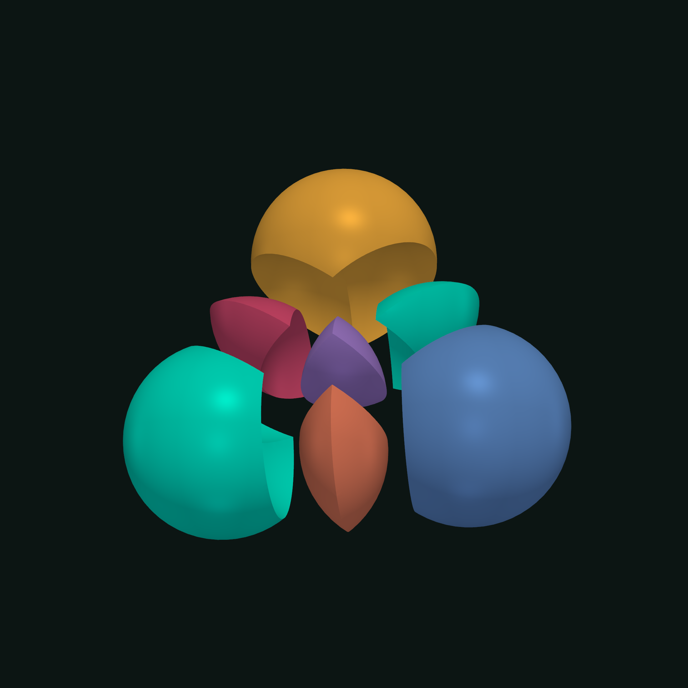
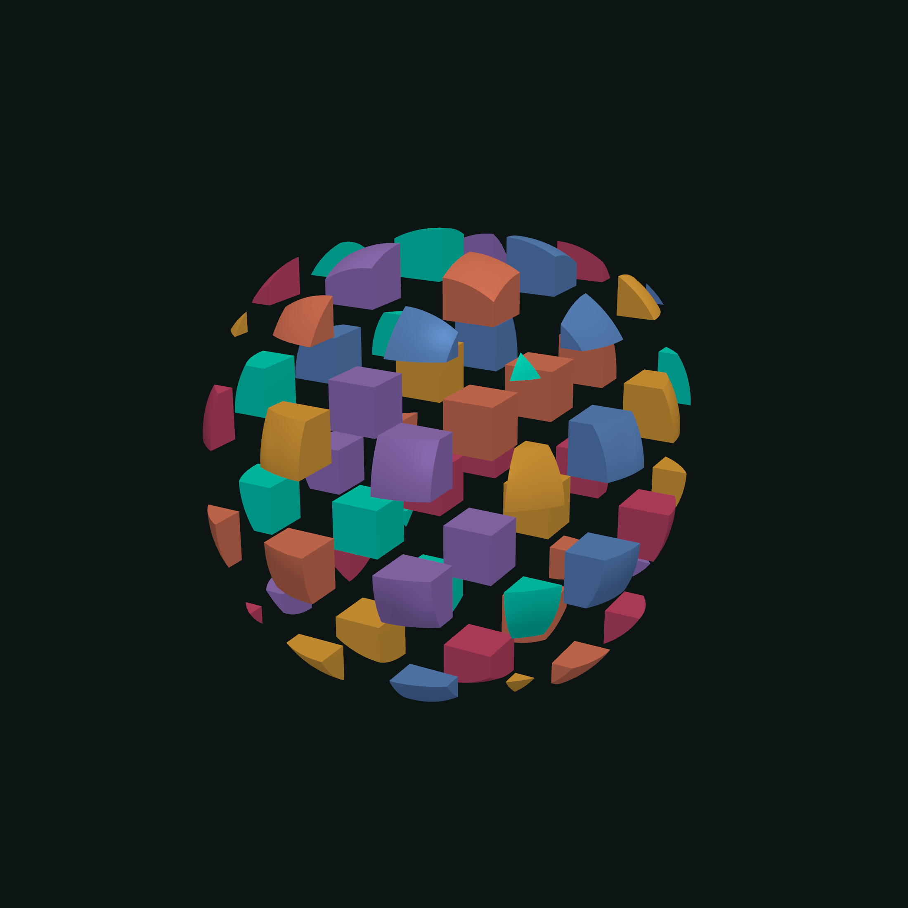

# pyvista-trueform



Exact mesh booleans, intersection curves, self-intersection repair,
isocontours and isobands, and N-ary CSG on [PyVista](https://pyvista.org)
meshes. PyVista in, PyVista out, through one `.trueform` accessor on
`pyvista.PolyData`.

## Getting Started

```bash
pip install pyvista-trueform
```

**The accessor** registers itself on import and answers through
`.trueform` on any `pyvista.PolyData`:

```python
import pyvista as pv
import pyvista_trueform  # registers the accessor

pv.Cube().trueform.volume()
```

**The cache** is whole-value: the accessor converts a dataset into a
`trueform.Mesh` once and caches it keyed by the dataset's VTK modification
time, so trueform's lazily built structures (spatial tree, face membership,
edge link) amortize across calls, and every operation that returns geometry
returns a fresh `pv.PolyData` with trueform's label arrays riding along as
cell data (`trueform_labels`, `trueform_face_labels`); when the dataset
changes, the next call rebuilds the mesh from scratch. One VTK pitfall:
mutating a raw NumPy view of the underlying arrays does not advance the
modification time, so the accessor would keep serving the stale mesh — call
`polydata.Modified()` after such edits, since assignments through PyVista's
own surface notify VTK already.

**A worked example** — a boolean carves the shape, `domains` reads the
pieces the arrangement made, and `pick` names the one a ray struck:

```python
import numpy as np
import pyvista as pv
import pyvista_trueform as tfpv
import trueform as tf

a = pv.Cube()
b = pv.Cube(center=(0.5, 0.5, 0.5))

carved = a.trueform.difference(b)               # boolean
blocks = tfpv.domains([a, b])                    # every overlap pocket, its own block
ray = tf.Ray(origin=np.array([-2, 0, 0], dtype=np.float32),
            direction=np.array([1, 0, 0], dtype=np.float32))
hit = tfpv.pick(blocks, ray)                      # hit.block_index names which one
```

The sections below cover the rest of the surface these three lean on.

### N-ary CSG

Build one arrangement of N operands and answer arbitrarily many boolean
expressions against it:

```python
import trueform as tf
from pyvista_trueform import csg_graph

graph = csg_graph([a, b, c])
graph.mesh(tf.op(0) - (tf.op(1) | tf.op(2))).plot()
```

Operands need not be triangulated: an all-triangle set stays a triangle
graph, anything else (quads, mixed) is re-expressed as dynamic faces first,
losslessly. A single operand is legal too — its own self arrangement.

`graph.mesh(...)`, `graph.domains()`, `graph.intersection_curves()`, and
`graph.outer_shell()` answer directly in PyVista types; the rest of the
graph's surface (`created_points`, `forms`, the construction state) lives on
`graph.native`, the underlying `trueform.CsgGraph`.

### Conversions

`to_trueform(polydata)` copies polygon geometry into a detached
`trueform.Mesh`; `to_pyvista(mesh_or_faces_points)` and
`curves_to_pyvista(paths, points)` go the other way zero-copy — trueform's
offset-block faces are exactly VTK 9's cell-array layout, and VTK retains
the NumPy buffers. Everything trueform offers beyond the accessor's headline
methods stays reachable by composition through these functions.

### IO

`tfpv.read(path)` and `tfpv.write(path, dataset)` move meshes through
trueform's parallel STL and OBJ readers and writers, dispatched on the path
suffix; reading converts zero-copy, STL welds duplicate vertices on the way
in.

### Domains and N-ary arrangements

`tfpv.domains([a, b, c])` partitions space by every surface and returns each
watertight volumetric domain as a block of a `pv.MultiBlock`, named by its
domain id — pass a prebuilt `csg_graph(...)` and an expression to restrict
it. `tfpv.mesh_arrangements([a, b, c])` returns the whole arrangement as one
labeled PolyData instead. `mesh.trueform.domains()` does the one-mesh case
directly: a mesh's own overlap pockets, from its self arrangement.

### Picking

`pick` and `closest` answer over any MultiBlock (nested ones flatten;
plain PolyData works too, as block 0) — not just domains — and name WHICH
block:

```python
import trueform as tf
from pyvista_trueform import csg_graph, domains, pick

blocks = domains(csg_graph([a, b]))
hit = pick(blocks, tf.Ray(origin=origin, direction=direction))
# you picked block hit.block_index at hit.point
```

`closest(blocks, query)` does the same by proximity: the query is a point
or a whole dataset/mesh (mesh-to-mesh through the witness-pair entry
`.trueform.closest_point_pair(other)`), and the hit carries the witness
point on the winning block and the euclidean distance.

### Remesh

`mesh.trueform.remeshed(target_length)`, `.decimated(proportion)`, and
`.simplified()` surface trueform's parallel isotropic remesher and
quadric-error tiers — boundary-, feature- and region-aware
(`preserve_regions` labels ride back as cell data).

### Queries

`mesh.trueform.volume()`, `.area()`, `.euler_characteristic()`,
`.ray_cast(ray, config=None)`, `.distance(other)`,
`.signed_distance(other)`, `.intersects(other)`, `.closest_point(point)`,
`.closest_point_pair(other)`, `.principal_curvatures()`, `.shape_index()`,
and `.boundary_curves()` answer against the cached mesh, so the spatial
tree amortizes across calls. Queries speak trueform primitives —
`ray_cast` takes a `tf.Ray(origin=..., direction=...)`, `signed_distance`
takes this dataset's own points as one batched query — and every value
this package names "distance" is euclidean.

### Registration

Five named functions, one per trueform fit, each taking only its own
callee's options over any point-bearing datasets or arrays and returning a
4x4 world-to-world matrix ready for `dataset.transform`:
`tfpv.align_rigid(source, target)` (Kabsch, correspondence required),
`tfpv.align_similarity(source, target)` (+ uniform scale, same
correspondence requirement), `tfpv.align_icp(source, target, ...)`
(iterative closest point), `tfpv.align_obb(source, target, ...)`
(oriented-bounding-box, no correspondences), and
`tfpv.align_knn(source, target, ...)` (one soft-correspondence step).
`tfpv.chamfer_distance(a, b)` is the one-way chamfer measure.

### Tubes

`tfpv.tube(lines, radius)` sweeps a triangle tube around line PolyData —
unordered 2-point segments are connected into polylines first — or around
the `(paths, points)` pair any trueform curve producer returns.

### Generators

`tfpv.box(width, height, depth)`, `.sphere(radius)`,
`.cylinder(radius, height)`, and `.plane(width, height)` build primitive
meshes centered at the origin, into a fresh PolyData zero-copy from
trueform's own arrays. Subdivision counts (`width_ticks`/`height_ticks`/
`depth_ticks` on the box and plane, `stacks`/`segments` on the sphere,
`segments` on the cylinder) and `dtype`/`index_dtype` are keyword-only
options; trueform's own defaults apply when omitted.

### Examples



Seven standalone scripts in `examples/`, each with an importable
`compute()` and a plotting `main()` (`python examples/<name>.py`); the
gallery ships in the Polydera color scheme through the shared
`examples/_theme.py`:

- `boolean.py` — a boolean difference recut live under a dragged sphere
  widget, the result labeled by source.
- `csg_fracture.py` — a sphere minus a grid of cutters through one
  csg_graph expression, read back as volumetric chunks; clicking a chunk
  names it through `closest`.
- `isobands.py` — height isobands and isocontours overlaid on a
  surface, recut live from a band-count slider.
- `curvature.py` — Gaussian curvature across a torus and mean curvature
  across a hills surface, from one `principal_curvatures` call each.
- `remesh_and_simplify.py` — remeshed, decimated, and simplified side by
  side.
- `alignment.py` — a transformed copy registered back with `align_rigid`,
  chamfer distance before and after.
- `raycast_depth.py` — an orthographic depth image from one batched
  `tf.Ray` cast.

### Coming with trueform 0.11

Orientation verdicts (`orient_faces_consistently`,
`ensure_positive_orientation`) — the Python binding still returns only the
repaired faces array, no verdict yet.

## License

Dual-licensed:
- **Noncommercial**: [PolyForm Noncommercial License 1.0.0](./LICENSE.noncommercial)
- **Commercial**: Contact [info@polydera.com](mailto:info@polydera.com)
